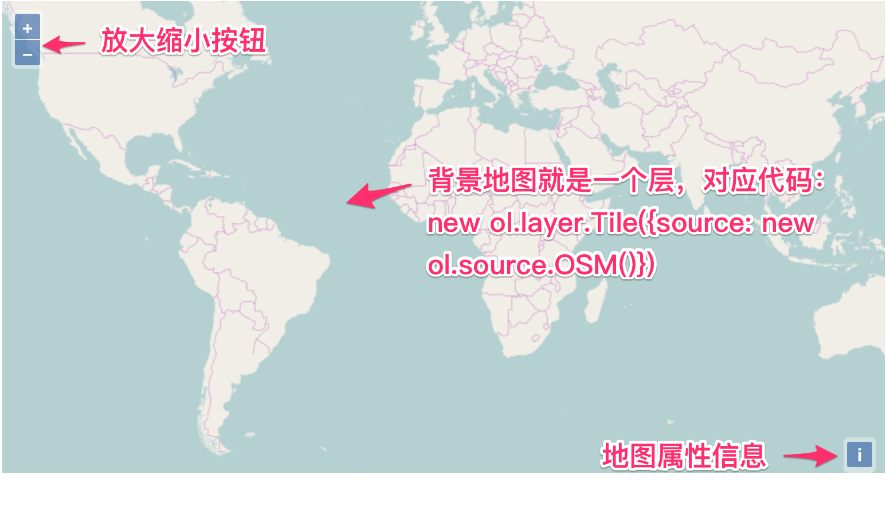

# 初步解析地图组成

创建地图的代码如此简单，以致于让一部分初学者误认为在此基础上的深入开发也很简单，这是一个非常错误的理解。此时，最关键的第一步是先弄明白每一句代码的含义，理解他们是如何组织起来的。否则，在后续的学习和使用过程中，犹如瞎子摸象，会找不到问题的关键点而迷失方向。让我们再次回顾一下之前那个简单地图的代码：

```javascript
		// 创建地图
	  new ol.Map({
			// 设置地图图层
			layers: [
			  // 创建一个使用Open Street Map地图源的瓦片图层
			  new ol.layer.Tile({source: new ol.source.OSM()})
			],
			// 设置显示地图的视图
			view: new ol.View({
			  center: [0, 0],	// 定义地图显示中心于经度0度，纬度0度处
			  zoom: 2			// 并且定义地图显示层级为2
			}),
			// 让id为map的div作为地图的容器
			target: 'map'	
		});
```

注意，其实上面这段代码就只有一条语句:
```javascript
new ol.Map({...});
```
其他代码只是用于设置地图的构造参数。由此可以推测出`ol.Map`是最主要的地图类，创建地图就需要构造这么一个对象。接下来依次分析每一个参数部分的代码。

* 参数`layers`:
```javascript	
layers: [
			  // 创建一个使用Open Street Map地图源的瓦片图层
			  new ol.layer.Tile({source: new ol.source.OSM()})
			],
```
从名字和具体的值可见这个地方可以设置多个`layer`，它是OpenLayers 3地图的组成结构单元，地图是由多个`layer`组成的，这种设计类似于Photoshop里面的图层，多个图层是可以叠加的，在最上面的会覆盖下面的，以此类推。这种设计方式在很多图形系统中存在。此处添加了一个[Open Street Map](http://www.openstreetmap.org/	)的地图`layer`。

* 参数`view`：
```javascript
view: new ol.View({
			  center: [0, 0],	// 定义地图显示中心于经度0度，纬度0度处
			  zoom: 2			// 并且定义地图显示层级为2
			}),
```
通过字面意思可以看出，它为地图定义显示窗口，对应`ol.View`类，可以自定义地图显示的中心点，缩放层级等。

* 参数`target`：
```
target: 'map'	
```
指定地图在页面中具体哪个位置进行显示，为此要记住地图显示还是离不开使用dom来实现。虽然和地图业务没什么关系，但也必不可少。

通过上面的源码解读，我们可以发现OpenLayers 3地图主要是由`layer`和`view`组成，`layer`可以有多个，`view`只能有一个。


上图能明确看到的是`layer`，看不出`view`在哪儿，只知道地图显示中心确实在经度0，纬度0处。除此之外，还能看到左上角的放大缩小按钮，以及右下角的属性信息按钮。如果在地图上双击鼠标左键，或者按住鼠标左键拖动，可以看到地图也是会放大或者移动的。这些都是分析代码并没有看到的。很明显OpenLayers 3有很多默认行为，一个地图的完整构成，远不是只有`view`和`layer`就行了。