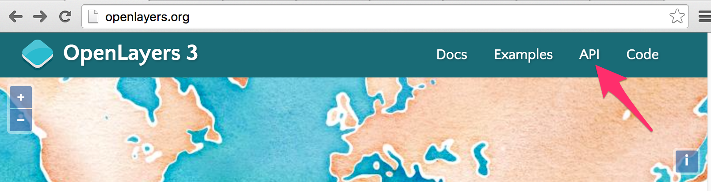
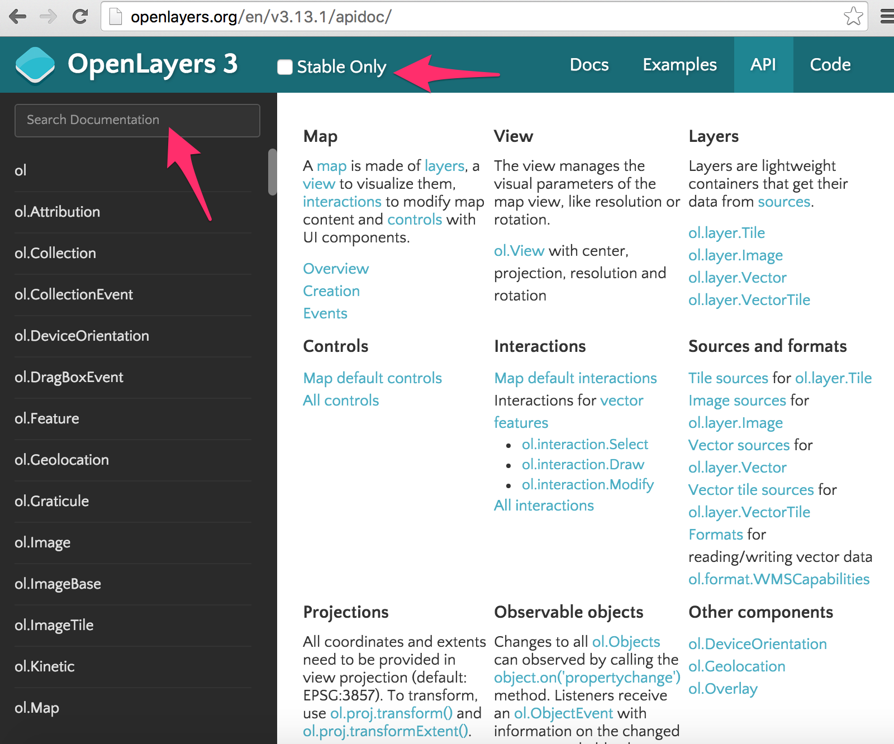
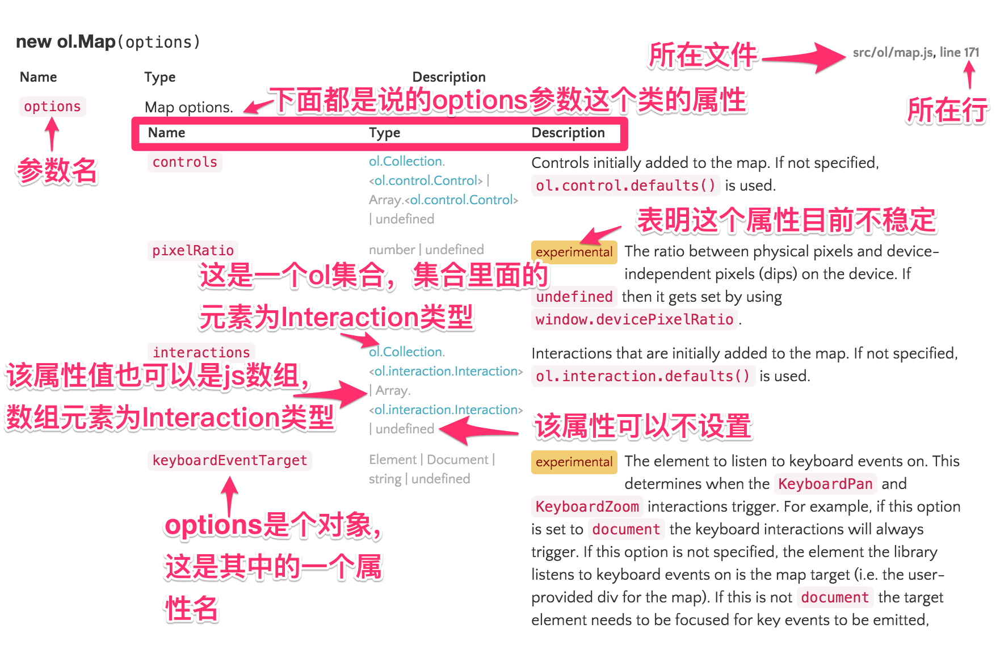

# 看懂API

或许你已经迫不及待的想开始学习第一个组成部分`Map`了，但在此之前，还是不得不先学会使用官网的API文档。因为API的重要性众人皆知，对于一个快速开发中的开源项目，更是如此，每一个小版本之间都可能有些许变化。所以在更新版本后，如果遇到API方法不存在或者功能不正确，则需要优先核对官网API文档。本着授之以鱼不如授之以渔的原则，学会看懂API文档是关键，而不是翻译API文档。。

## API文档入口
在浏览器中打开[OpenLayers官网 http://openlayers.org/](http://openlayers.org/)，下图箭头所指向的地方即为API文档链接：

点击进入即为整个API文档的首页，页面上方为工具栏，左边为搜索栏和列表，右边为OpenLayers 3组成部分的介绍，都是相关的类和一些简介。

上方工具栏中的`Stable Only`复选框选中后，API文档就只会显示功能已经稳定的类，参数，接口等信息。在查找新功能或新特性时，建议不要勾选。 

右边页面显示了地图组成的介绍，Map、View、Layers列在第一排，第二排及第三排依次列出了其他的组成部分。有简单的介绍，及对应的包和类，可以通过这些资料加深对他们的认识。

## 查找
左边的列表会根据搜索栏的内容进行过滤。大家可以尝试一下，在这里能搜索包名，类名，方法名和事件名。包名比如`ol.layer`，`ol.source`等，方法名比如`setCenter`，`setZoom`等，类名比如`View`，`Map`等，事件名比如`change:layers。但目前还不支持文档里面的内容的文本搜索。

## API文档介绍
此处以`ol.Map`类的API文档为例进行说明。在搜索栏输入`ol.Map`，很快下方列表中的内容就变了，排在中第一项的就是`ol.Map`类，点击它，右边页面内容就变成了它的说明文档。文档内容从上向下，共分为三部分：
* 类介绍，主要介绍该类用途，建议仔细阅读，这样才能根据具体业务找对需要的类。
* 构造参数、事件及继承关系，该内容的重要性无需多言，看不明白，就无法创建该类的对象。
* 类的所有方法，建议浏览一下，了解每个方法所实现的功能，在需要时，再详细查看对应的参数和使用方式。

请结合上面的内容快速浏览一下`ol.Map`的说明文档，感受一下，总的来说，OpenLayers 3的API文档是比较全面的，内容也挺详实(ol3的API文档是从代码的注释中通过工具提取生产的，所以时刻能保持更新，且完全符合JSDoc规范，文档和代码完全匹配)。

文档中类的介绍部分是否能看懂，因人而异，当了解的越多，就越容易看明白。因为它只是类的一些简要说明，谈不上详细，也没有对应的应用说明。有些类的用途需要结合到其他的知识才能更明白。在不是很明白的情况下，建议多结合类提供的方法的用途来一起理解。

类的构造参数采用的是[JSDoc](http://usejsdoc.org/)规范定义的，使用工具提取而出，生成了下面的参数文档，在此对其格式进行简要说明，参见下面图解：

页面右边的文件和行号标注都是可点击的，点击打开跳转到对应的源码，对于探究背后实现，或者分析Bug非常有用。然后是参数说明，很多对象的构造参数都是对象，以`{key1:value1, key2:value2}`这样的方式设置。这种方式有两方面的好处：
* 可以只设置需要的参数，或者增加自定义参数
* 易于为指定参数设置正确的值，避免值对应到错误的参数上。

需要注意的是参数类型`Type`的说明，使用符号`|`表示该参数可以赋予多种类型的值，对开发者是非常友好的，灵活强大。参数类型如果是容器，都会使用`<>`来表示。如果是OpenLayers 3自定义的类型，都是可以点击查看的。若为JavaScript的原生类型或DOM类型，则只给出类型名。对于各个参数的描述信息，就是一段文字，都比较详细。

除了参数之外，在OpenLayers 3中还大量使用了事件，用于解决实时通知的问题，这是典型的观察者模式。当对象改变时，能触发相应的操作。在API文档中，明确标注了各个类的事件，以及触发该事件的条件和时机。它们都列在`Fires:`这一栏，比如`ol.Map`就有很多事件，`click`、`dbclick`、`singleclick`、`moveend`等等。这些事件对于开发者来说非常重要，除了OpenLayers 3需要大量使用这些事件，很多应用开发也需要使用它们来实现一些关键功能。关于事件更详细的说明参见[事件](../ch07/index.md)。

在事件说明之后，还有类继承的说明。`Subclasses`列出了当前类的所有子类；`Extends`列出了当前类的父类。不要小瞧这个说明，因为在面向对象编程范式中，所有能用父类的地方，都可以用子类。比如`ol.Map`的构造参数`options`可以设置`layers`属性，它的值是`ol.layer.Base`类型元素的集合，那么就可以用`ol.layer.Base`的子类`ol.layer.Group`或`ol.layer.Layer`，以此类推，也可以用这两个类的子类`ol.layer.Image`、`ol.layer.Tile`、`ol.layer.Vector`等。这样我们就知道具体哪些参数能用哪些类了。

最后就是这个类所有方法的说明了。方法的说明包含方法名，参数，以及方法功能描述。同类的说明差不多，为此不再累述。

最后，提醒一下，在遇到任何问题时，请优先查询API文档来排忧解惑。
