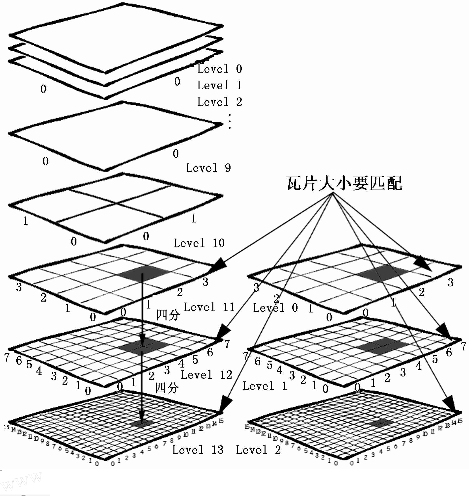
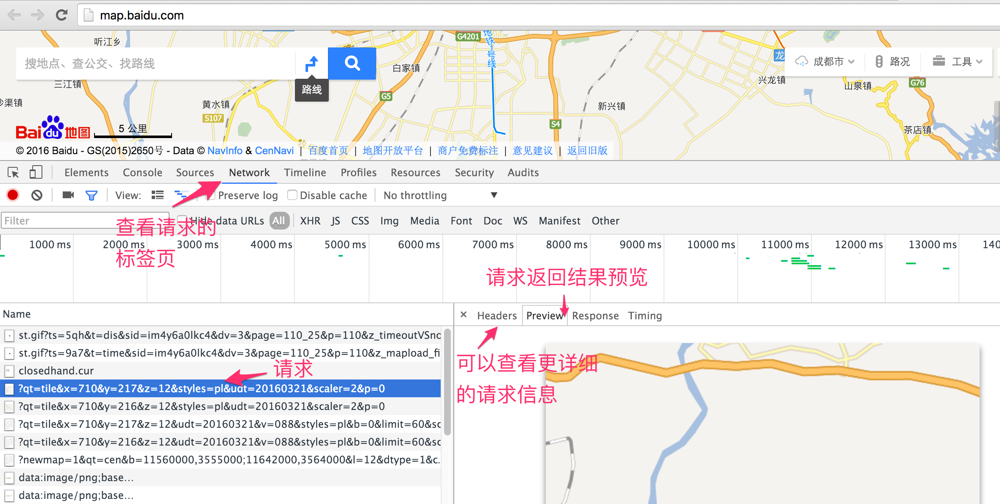
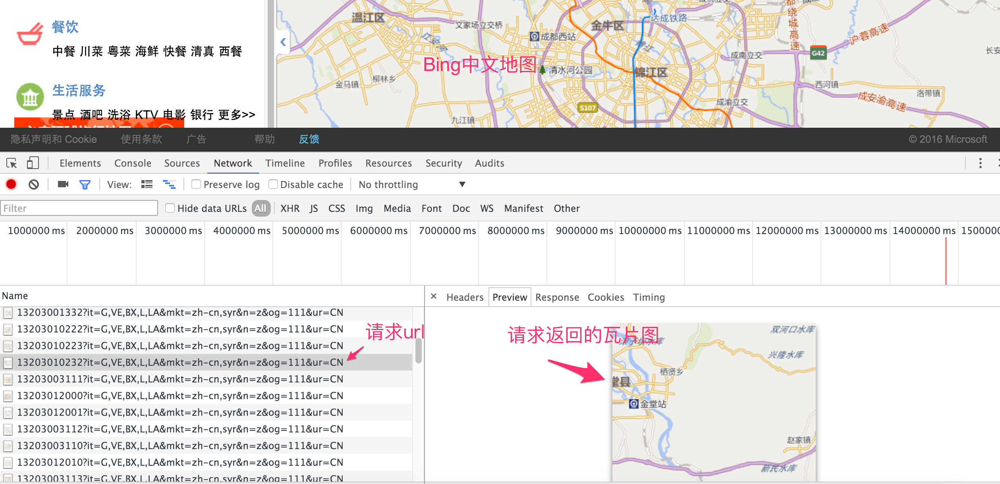

# 万能瓦片地图加载秘籍

其实加载瓦片地图基本是大同小异，你可能会觉得很惊讶，因为网上在线的地图服务，看起都不一样，本节即将为你解开这层神秘的面纱。在前面已基本介绍了瓦片地图的解决方案和作用，此处再用一张图来直观地认识一下瓦片结构：


从上图可知，大家常用的瓦片地图是一个三维的概念，我们通常使用xyz这样的坐标来精确定位一张瓦片。通常z用于表示地图层级，而xy表示某个层级内的瓦片平面，x为横纵坐标，y为纵轴坐标，类似于数学上常见的笛卡尔坐标系。在这个瓦片平面上的每一个瓦片在横轴和纵轴上都有对应的坐标：x和y。

## 加载简单的瓦片地图
虽然现在大多数网页地图都使用的是瓦片地图，但还是有必要先介绍一下如何识别它。在浏览器中打开任意一个在线的网页地图，然后打开浏览器的开发者工具，再随意拖动，放大缩小地图。之后在开发者工具里查看新发起的请求，是否有一些图片请求，查看请求返回的图片，是否为正在浏览的地图的一部分，如果是，则基本为瓦片地图。下面以百度地图为例，说明一下在线瓦片地图请求信息：


在请求的url中，我们可以很明显地看到xyz这三个参数，这进一步说明了百度地图就是用了瓦片地图。如果你多分析一下现有的在线网页地图，基本都是瓦片地图。正因为如此，OpenLayers 3提供了`ol.source.XYZ`这种通用的`Source`来适应广大的在线瓦片地图数据源，具备很好的适用性。通常情况下，开发者想要加载不同的在线瓦片地图源，则只需要更改`ol.source.XYZ`的构造参数中`url`就可以了。 比如我们就可以不用`ol.source.OSM`，而用`ol.source.XYZ`来加载Open Street Map地图，结果一样：

```html
<body>
	<div id="map" style="width: 100%"></div>
	<script>
		// Open Street Map 地图层
		var openStreetMapLayer = new ol.layer.Tile({
			source: new ol.source.XYZ({
				url: 'http://{a-c}.tile.openstreetmap.org/{z}/{x}/{y}.png'
			})
		});

		// 创建地图
	  var map = new ol.Map({
			layers: [
				openStreetMapLayer
			],
			view: new ol.View({
				// 设置成都为地图中心
				center: [104.06, 30.67],
				projection: 'EPSG:4326',
				zoom: 10
			}),
			target: 'map'
	  });
	</script>
</body>
```
除了Open Street Map可以这样加载外，还有很多其他的在线瓦片地图源也可以，比如高德地图：

```javascript
// 高德地图层
var gaodeMapLayer = new ol.layer.Tile({
	source: new ol.source.XYZ({
		url:'http://webst0{1-4}.is.autonavi.com/appmaptile?lang=zh_cn&size=1&scale=1&style=7&x={x}&y={y}&z={z}'
	})
});
```
比如Yahoo地图：
```javascript
// yahoo地图层
var yahooMapLayer = new ol.layer.Tile({
	source: new ol.source.XYZ({
		tileSize: 512,
		url:'https://{0-3}.base.maps.api.here.com/maptile/2.1/maptile/newest/normal.day/{z}/{x}/{y}/512/png8?lg=ENG&ppi=250&token=TrLJuXVK62IQk0vuXFzaig%3D%3D&requestid=yahoo.prod&app_id=eAdkWGYRoc4RfxVo0Z4B'
	})
});
```
大同小异，非常简单。上面的三个例子，只有Yahoo地图的代码有点不一样：多了`tileSize`参数的设置。默认情况下，`tileSize`为256，这也是现在绝大多数瓦片采用的大小。但Yahoo地图使用的是512，所以我们需要显示指定。

## 瓦片地图之百度地图
通过上面的示例我们已经发现，其实可以非常轻松地加载多种不同来源的在线瓦片地图。但遗憾地是，上面这种简单方法并不适用于所有的在线瓦片地图，总有一些是特殊的，比如百度地图，上面这种方式就不生效了。此时，我们需要回过头来思考一下瓦片地图加载的整个过程：瓦片地图加载的关键在于找对瓦片，但要找对瓦片，就得知道瓦片的坐标，而坐标又需要明确的坐标系。我们在[坐标](../ch04/04-02.md)里说过，任何坐标都得有坐标系才有意义。在OpenLayers 3中，默认使用的瓦片地图的坐标系是如何定义的？经分析可知，OpenLayers 3的瓦片坐标系的原点在左上角，向上为y轴正方向，向右为x轴正方向。具体到地图上来讲，地球经过投影，投影到一个平面上，平面最左边对应地球最西边，平面最上边对应地球最北边。原点就处于整个平面的左上角，即地球的西北角，从北向南为y轴负方向，从西向东为x轴正方向。理解这一点非常重要，因为并不是所有在线的瓦片地图都是采用这样的坐标系。用OpenLayers 3加载它们的时候，如果坐标系不同，计算出来的瓦片地址就获取不到对应的瓦片，为解决这个问题，我们必须要先对瓦片坐标进行转换。那么，具体该怎么实现转换？最详细明了的方式还是看实例，下面我们看一下加载百度地图一种实现方式：
<head>                  
	<link href="../src/ol3.13.1/ol.css" rel="stylesheet" type="text/css" />
	<script type="text/javascript" src="../src/ol3.13.1/ol.js" charset="utf-8"></script>
</head>
<div id="baiduMap" style="width: 100%"></div>
<script>
	// 百度地图层
	var baiduMapLayer = new ol.layer.Tile({
		source: new ol.source.XYZ({
			tilePixelRatio: 2,
			tileUrlFunction: function(tileCoord){ // 参数tileCoord为瓦片坐标
					var z = tileCoord[0];
          var x = tileCoord[1];
          var y = tileCoord[2];

          var halfTileNum = Math.pow(2, z-1);

          var baiduX =  x - halfTileNum;
          var baiduY =  y + halfTileNum;

          if (baiduX < 0) {
          	baiduX = 'M' + (-baiduX);
          }
          if (baiduY < 0) {
          	baiduY = 'M' + (-baiduY);
          }

          return 'http://online2.map.bdimg.com/onlinelabel/?qt=tile&x=' + baiduX + '&y=' + baiduY + '&z=' + z + '&styles=pl&udt=20160321&scaler=2&p=0';
			}
		})
	});

	// 创建地图
  var map = new ol.Map({
		layers: [
			baiduMapLayer
		],
		view: new ol.View({
			// 设置成都为地图中心
			center: [104.06, 30.67],
			projection: 'EPSG:4326',
			zoom: 4
		}),
		target: 'baiduMap'
  });
</script>

代码如下：
```html
<div id="baiduMap" style="width: 100%"></div>
<script>
	// 百度地图层
	var baiduMapLayer = new ol.layer.Tile({
		source: new ol.source.XYZ({
			tilePixelRatio: 2,
			tileUrlFunction: function(tileCoord){  // 参数tileCoord为瓦片坐标
				var z = tileCoord[0];
        var x = tileCoord[1];
        var y = tileCoord[2];

        // 计算当前层级下瓦片总数的一半，用于定位整个地图的中心点
        var halfTileNum = Math.pow(2, z-1);
        // 原点移到中心点后，计算xy方向上新的坐标位置
        var baiduX =  x - halfTileNum;
        var baiduY =  y + halfTileNum;

        // 百度瓦片服务url将负数使用M前缀来标识
        if (baiduX < 0) {
        	baiduX = 'M' + (-baiduX);
        }
        if (baiduY < 0) {
        	baiduY = 'M' + (-baiduY);
        }

        // 返回经过转换后，对应于百度在线瓦片的url
        return 'http://online2.map.bdimg.com/onlinelabel/?qt=tile&x=' + baiduX + '&y=' + baiduY + '&z=' + z + '&styles=pl&udt=20160321&scaler=2&p=0';
			}
		})
	});

	// 创建地图
  var map = new ol.Map({
		layers: [
			baiduMapLayer
		],
		view: new ol.View({
			// 设置成都为地图中心
			center: [104.06, 30.67],
			projection: 'EPSG:4326',
			zoom: 4
		}),
		target: 'baiduMap'
  });
</script>
```
和前面几个加载在线瓦片地图的例子不一样的地方在于，我们没有设置`url`，而是设置了`tileUrlFunction`，这是一个获取瓦片`url`的函数，如果自定义这个函数，就可以实现不同坐标系之间的转换，从而返回在线地图服务对应瓦片的`url`。通过代码可以看到，函数入参是一个瓦片坐标，然后进行一系列的转换，得到百度在线地图的瓦片地址。效果参见上方地图，不妨拖动、缩放试试，拼接无缝，并没有什么问题。

`tileUrlFunction`这个自定义函数的代码实现有可能看不懂，虽然知道在进行坐标转换，但并不知道为什么要这样实现。为了彻底弄明白代码，我们必须得把之前遗漏的一个很重要环节补上：弄明白待加载的在线瓦片地图的坐标系。对百度在线瓦片坐标系进行简单分析发现，它是以某一个位置为原点，向右为x正方向，向上为y正方向的坐标系，进一步分析发现，原点应该在中心位置，为此，我们假设百度地图是以经纬度[0,0]为原点，在此基础上编写函数`tileUrlFunction`的实现。`halfTileNum`表示的是在当前缩放层级之下，总的瓦片个数的一半，意味着它就是中心位置。对于`baiduX`小于0的情况，百度使用了`M`来表示负号，所以要特殊处理一下。想必这下应该更加理解代码实现了。不同的在线瓦片地图的转换代码可能不同，需要根据对应的坐标系来确定。


但上面这个地图并不完美，因为我们设定的地图中心为成都，然而实际上显示的地图中心并不在成都。虽然无缝拼接，但位置偏差有点远。由此基本可以排除坐标转换的问题，看起来应该是OpenLayers 3的分辨率和百度在线瓦片地图使用的分辨率对不上。经过分析发现，确实如此，在网上也有很多分析文章可以查阅。那么我们是否可以重新定义分辨率呢？ 答案是肯定的，我们可以使用`ol.source.XYZ`的父类来解决问题。


## 重新定义OpenLayers 3的瓦片坐标系
`ol.source.TileImage`作为`ol.source.XYZ`的父类，除了可以转换坐标之外，还具备更加强大的功能，修改分辨率。下面我们使用它来加载百度地图，这次是正确的：
<div id="baiduMap2" style="width: 100%"></div>
<script>

	// 自定义分辨率和瓦片坐标系
  var resolutions = [];
  var maxZoom = 18;

  for(var i=0; i<=maxZoom; i++){
      resolutions[i] = Math.pow(2, maxZoom-i);
  }
  var tilegrid  = new ol.tilegrid.TileGrid({
      origin: [0,0],
      resolutions: resolutions
  });

  // 创建百度地图的数据源
  var baiduSource = new ol.source.TileImage({
      projection: 'EPSG:3857',
      tileGrid: tilegrid,
      tileUrlFunction: function(tileCoord, pixelRatio, proj){
          var z = tileCoord[0];
          var x = tileCoord[1];
          var y = tileCoord[2];

          if(x<0){
              x = "M"+(-x);
          }
          if(y<0){
              y = "M"+(-y);
          }

          return "http://online3.map.bdimg.com/onlinelabel/?qt=tile&x="+x+"&y="+y+"&z="+z+"&styles=pl&udt=20160321&scaler=2&p=1";
      }
  });

	// 百度地图层
	var baiduMapLayer2 = new ol.layer.Tile({
		source: baiduSource
	});

	// 创建地图
  new ol.Map({
		layers: [
			baiduMapLayer2
		],
		view: new ol.View({
			// 设置成都为地图中心
			center: [104.06, 30.67],
			projection: 'EPSG:4326',
			zoom: 10
		}),
		target: 'baiduMap2'
  });
</script>

对应的代码：
```html
<div id="baiduMap2" style="width: 100%"></div>
<script>

	// 自定义分辨率和瓦片坐标系
  var resolutions = [];
  var maxZoom = 18;

  // 计算百度使用的分辨率
  for(var i=0; i<=maxZoom; i++){
      resolutions[i] = Math.pow(2, maxZoom-i);
  }
  var tilegrid  = new ol.tilegrid.TileGrid({
      origin: [0,0],	// 设置原点坐标
      resolutions: resolutions	// 设置分辨率
  });

  // 创建百度地图的数据源
  var baiduSource = new ol.source.TileImage({
      projection: 'EPSG:3857',	
      tileGrid: tilegrid,
      tileUrlFunction: function(tileCoord, pixelRatio, proj){
          var z = tileCoord[0];
          var x = tileCoord[1];
          var y = tileCoord[2];

          // 百度瓦片服务url将负数使用M前缀来标识
          if(x<0){
              x = 'M' + (-x);
          }
          if(y<0){
              y = 'M' + (-y);
          }
 
          return "http://online0.map.bdimg.com/onlinelabel/?qt=tile&x="+x+"&y="+y+"&z="+z+"&styles=pl&udt=20160426&scaler=1&p=0";
      }
  });

	// 百度地图层
	var baiduMapLayer2 = new ol.layer.Tile({
		source: baiduSource
	});

	// 创建地图
  new ol.Map({
		layers: [
			baiduMapLayer2
		],
		view: new ol.View({
			// 设置成都为地图中心
			center: ol.proj.transform([104.06, 30.67], 'EPSG:4326', 'EPSG:3857'),
			zoom: 10
		}),
		target: 'baiduMap2'
  });
</script>
```
这个代码同上面的代码相比，引入了`ol.tilegrid.TileGrid`，由名字可见，这是定义瓦片网格，其实就是瓦片坐标系，构造时需要设定原点，紧接着设置分辨率，其作用在于设定每一地图层级的分辨率。我们是否遗漏了坐标系的正向和负向的设定？默认情况下，从左向右为x正方向，从下向上为y轴正方向。这和我们数学上通常定义的笛卡尔坐标系是一样的，这一点需要大家记住。如代码所示，就可以重新定义OpenLayers 3的瓦片地图坐标系，这种方式的代码比上一种方式更加的可读和简洁。 如果用通用的方法解决不了，请别忘记还有这一强大灵活的处理方式。

## 分析瓦片地图坐标系
如何分析不同在线瓦片地图的坐标系呢？非常重要的一点是，先从特例出发，找简单的情况分析，比如选择z为2或者3进行分析，这种情况下，瓦片的数量比较少，可以查看整个地球范围内的地图的瓦片请求，注意分析其请求的`url`参数。上述的所有地图都可以以这样的方式入手来分析，包括百度地图，可以自行尝试该方法。如果你有更好的方法，愿意的话，请给大家一起分享一下。

## 解密瓦片url
瓦片的url解析对于想直接使用在线瓦片服务的开发者而言，是一项经常要做的事。根据难度，大致可以分为三种情况：

* 第一种是最简单的，请求瓦片的`url`明确有xyz参数，比如高德地图和百度地图。
* 第二种稍微难一点，`xyz`作为路径直接存在于`url`里面，没有明确的参数表明哪些是xyz，比如Open Street Map和Yahoo地图，这种情况下，地图服务器接收到请求后，就直接在服务器按照这个路径获取图片，按照这个逻辑，一般第一个参数表示是z，第二个参数为x，第三个参数为y。要想确认是否真是这样，可以写一个小程序来验证一下，如果还有问题，建议按照上面分析地图坐标系中的方法，从z比较小的情况入手来分析x，y，z的位置。
* 第三种则最难，地图服务提供商为了防止大家直接非法使用瓦片地图，对瓦片的url进行了加密，比如现在的微软Bing中文地图和Google地图，这种情况下只有知道如何解密才能使用。

## 加载微软Bing中文地图
前面两种url的实例已经有了，此处分享一下第三种情况的url解密，以微软Bing中文地图为例：


图中显示的瓦片地图请求的url，没有明显的xyz参数，最有可能的存放xyz参数的地方在于url前面那一串数字，真实情况确实是这样的，经过分析和解码，最终实现了加载Bing中文地图：

<div id="bingMap" style="width: 100%"></div>
<script>
	// Bing中文地图层
	var bingMapLayer = new ol.layer.Tile({
		source: new ol.source.XYZ({
			tilePixelRatio: 2,
			tileUrlFunction: function(tileCoord){
				var z = tileCoord[0];
        var x = tileCoord[1];
        var y = -tileCoord[2] - 1;
        var result='', zIndex=0;

        for(; zIndex<z; zIndex++) {
            result = ((x&1)+2*(y&1)).toString() + result;
            x >>= 1;
            y >>= 1;
        }
        return 'http://dynamic.t0.tiles.ditu.live.com/comp/ch/' + result + '?it=G,VE,BX,L,LA&mkt=zh-cn,syr&n=z&og=111&ur=CN';
      }
		})
	});

	// 创建地图
  var map = new ol.Map({
		layers: [
			bingMapLayer
		],
		view: new ol.View({
			// 设置成都为地图中心
			center: [104.06, 30.67],
			projection: 'EPSG:4326',
			zoom: 10
		}),
		target: 'bingMap'
  });
</script>

代码如下：
```html
<div id="bingMap" style="width: 100%"></div>
<script>
	// Bing中文地图层
	var bingMapLayer = new ol.layer.Tile({
		source: new ol.source.XYZ({
			tileUrlFunction: function(tileCoord){
				var z = tileCoord[0];
        var x = tileCoord[1];
        var y = -tileCoord[2] - 1;
        var result='', zIndex=0;

        for(; zIndex<z; zIndex++) {
            result = ((x&1)+2*(y&1)).toString() + result;
            x >>= 1;
            y >>= 1;
        }
        return 'http://dynamic.t0.tiles.ditu.live.com/comp/ch/' + result + '?it=G,VE,BX,L,LA&mkt=zh-cn,syr&n=z&og=111&ur=CN';
      }
		})
	});

	// 创建地图
  var map = new ol.Map({
		layers: [
			bingMapLayer
		],
		view: new ol.View({
			// 设置成都为地图中心
			center: [104.06, 30.67],
			projection: 'EPSG:4326',
			zoom: 10
		}),
		target: 'bingMap'
  });
</script>
```

需要注意的是地图数据是非常昂贵的，如果使用某一个在线地图服务，请先核实对方的版权和数据使用申明，不要侵犯对方的权益，按照要求合法使用地图。几乎所有的在线地图服务都提供了响应的服务接口，强烈建议在商用项目中使用这些接口。对于这些接口的使用，服务商都有详细的说明，在此不累述。

# google地图加载
有许多人都在问google地图加载的问题，因为地图url是加密的，通过分析url，可以采用下面的方式来加载：
<div id="googleMap" style="width: 100%"></div>
<script>
	// google地图层
	var googleMapLayer = new ol.layer.Tile({
		source: new ol.source.XYZ({
			url:'http://www.google.cn/maps/vt/pb=!1m4!1m3!1i{z}!2i{x}!3i{y}!2m3!1e0!2sm!3i345013117!3m8!2szh-CN!3scn!5e1105!12m4!1e68!2m2!1sset!2sRoadmap!4e0'
		})
	});

	// 创建地图
  var map = new ol.Map({
		layers: [
			googleMapLayer
		],
		view: new ol.View({
			// 设置成都为地图中心
			center: [104.06, 30.67],
			projection: 'EPSG:4326',
			zoom: 10
		}),
		target: 'googleMap'
  });
</script>

代码如下：
```html
<div id="googleMap" style="width: 100%"></div>
<script>
	// google地图层
	var googleMapLayer = new ol.layer.Tile({
		source: new ol.source.XYZ({
			url:'http://www.google.cn/maps/vt/pb=!1m4!1m3!1i{z}!2i{x}!3i{y}!2m3!1e0!2sm!3i345013117!3m8!2szh-CN!3scn!5e1105!12m4!1e68!2m2!1sset!2sRoadmap!4e0'
		})
	});

	// 创建地图
  var map = new ol.Map({
		layers: [
			googleMapLayer
		],
		view: new ol.View({
			// 设置成都为地图中心
			center: [104.06, 30.67],
			projection: 'EPSG:4326',
			zoom: 10
		}),
		target: 'googleMap'
  });
</script>
```

至此，关于通用瓦片地图加载的秘籍就介绍完毕，希望大家都掌握了。


