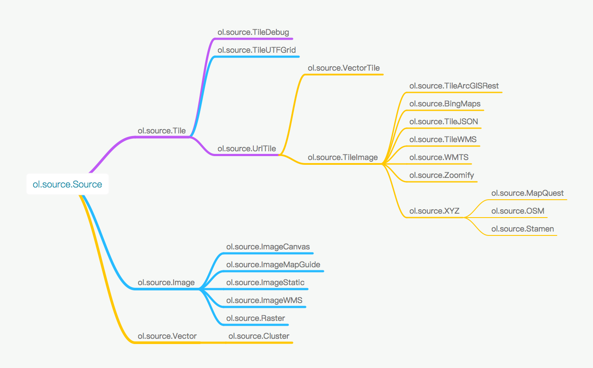
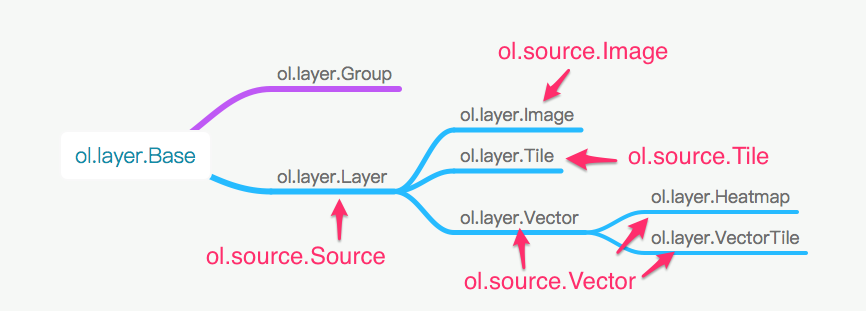

# Source和Layer

在前面的例子中，已经对`Source`和`Layer`有所了解了。比如我们加载了Open Street Map的地图。然而世界上的地图并不只有Open Street Map，还有很多其他的地图，比如Google地图，天地图，高德地图，百度地图等。如果OpenLayers支持的地图来源越多，就会越适用，越强大。除了加载基本的地图之外，GIS还需要加载很多其他的信息，比如街道名称，商店名称，公交站点，道路等等。那么在OpenLayers 3中，具体该如何把这些添加在地图上呢？

首先需要明白的一点是，`Source`和`Layer`是一对一的关系，有一个`Source`，必然需要一个`Layer`，然后把这个`Layer`添加到`Map`上，就可以显示出来了。通过官网的API搜索`ol.source`可以发现有很多不同的`Source`，但归纳起来共三种：`ol.source.Tile`，`ol.source.Image`和`ol.source.Vector`。 

* `ol.source.Tile`对应的是瓦片数据源，现在网页地图服务中，绝大多数都是使用的瓦片地图，而OpenLayers 3作为一个WebGIS引擎，理所当然应该支持瓦片。
* `ol.source.Image`对应的是一整张图，而不像瓦片那样很多张图，从而无需切片，也可以加载一些地图，适用于一些小场景地图。
* `ol.source.Vector`对应的是矢量地图源，点，线，面等等常用的地图元素(Feature)，就囊括到这里面了。这样看来，只要这两种`Source`就可以搞定80%的需求了。

从复杂度来分析，`ol.source.Image`和`ol.source.Vector`都不复杂，其数据格式和来源方式都简单。而`ol.source.Tile`则不一样，由于一些历史问题，多个服务提供商，多种标准等诸多原因，导致要支持世界上大多数的瓦片数据源，就需要针对这些差异提供不同的`Tile`数据源支持。在更进一步了解之前，我们先来看一下OpenLayers 3现在支持的`Source`具体有哪些：

上图中的类是按照继承关系，从左向右展开的，左边的为父类，右边的为子类。在使用时，一般来说，都是直接使用叶子节点上的类，基本就可以完成需求。父类需要自己进一步扩展或者处理才能有效使用的。

我们先了解最为复杂的`ol.source.Tile`，其叶子节点类有很多，大致可以分为几类：
* 在线服务的`Source`，包括`ol.source.BingMaps`(使用的是微软提供的Bing在线地图数据)，`ol.source.MapQuest`(使用的是MapQuest提供的在线地图数据)(注: 由于MapQuest开始收费，ol v3.17.0就移除了`ol.source.MapQuest`)，`ol.source.OSM`(使用的是Open Street Map提供的在线地图数据)，`ol.source.Stamen`(使用的是Stamen提供的在线地图数据)。没有自己的地图服务器的情况下，可直接使用它们，加载地图底图。
* 支持协议标准的`Source`，包括`ol.source.TileArcGISRest`，`ol.source.TileWMS`，`ol.source.WMTS`，`ol.source.UTFGrid`，`ol.source.TileJSON`。如果要使用它们，首先你得先学习对应的协议，之后必须找到支持这些协议的服务器来提供数据源，这些服务器可以是地图服务提供商提供的，也可以是自己搭建的服务器，关键是得支持这些协议。
* ol.source.XYZ，这个需要单独提一下，因为是可以直接使用的，而且现在很多地图服务（在线的，或者自己搭建的服务器）都支持xyz方式的请求。国内在线的地图服务，高德，天地图等，都可以通过这种方式加载，本地离线瓦片地图也可以，用途广泛，且简单易学，需要掌握。

`ol.source.Image`虽然有几种不同的子类，但大多比较简单，因为不牵涉到过多的协议和服务器提供商。而`ol.source.Vector`就更加的简单了，但有时候其唯一的子类`ol.source.Cluster`在处理大量的`Feature`时，我们可能需要使用。

在大概了解了整个`Source`之后，紧接着该介绍它的搭档`Layer`了，同样的，我们还是先从OpenLayers 3现有的`Layer`类图大致了解一下：

为了便于了解和使用，图中标注了每一个`Layer`对应的`Source`。通过上图可以看到`Layer`相对于`Source`而言，真是太简单了。

对于初学者而言，如何选择和应用不同的`Source`和`Layer`是一个非常迷惑和困难的问题。为此，本章将围绕着`Source`和`Layer`展开，为大家解决这个问题。