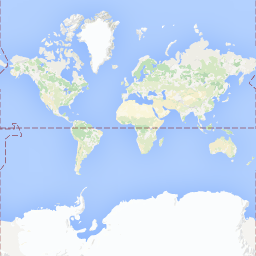
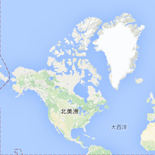
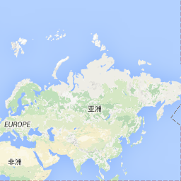
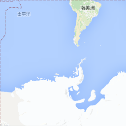
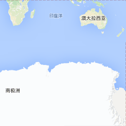

# LOD原理
在详细讲解之前，假设给你两张A4纸，在其中一张纸上把你家整个绘制上去，在另一张纸上只把你睡的房间绘制上去。如果别人想看你家，你会给哪一张纸？如果想看你睡的房间，你会给哪一张纸？ 相信你不会给错，`LOD`就是这种根据不同需要，采用不同图的技术方案。在地图应用中，最直观的体验，就是地图放大缩小。当地图放大后，能看到更详细的地理信息，比如街道，商店等等。当地图缩小再缩小，原来能看到的街道，商店就看不见了，当能看到更大的区域，我们的屏幕就相当于是A4纸，大小不变。 

`LOD`这个技术方案非常棒，非常符合我们的自然习惯，所以在很多图形系统中都使用了这项技术。在GIS系统中，不断放大，就能看到更多地图细节，了解更加详细的信息。对于`GIS`引擎的开发者而言，需要实现这项技术，当发现用户放大地图时，就立马使用更有细节的地图图片，替换现在显示的地图图片。 现在问题来了：意思是说对于同一个地点而言，需要有很多张呈现不同细节程度的图片？是的，你没有猜错，虽然在使用地图的过程中，感觉放大缩小地图是浑然一体的，但其实就在你眼皮下发生了图片替换。 不同层级使用具有不同细节的地图图片，这就需要为每一个层级准备图片，如果使用离线工具下载瓦片地图，会看到下载的图片是按照层级Z进行存储的。开发者不用担心数据源的处理，只需要知道这个原理就可以了。

为了便于理解GIS系统中不同层级，使用不同的图片，下面使用google在线瓦片地图进行说明。 最小层级0情况下，只用了一张256*256像素的图片表示整个地球平面：

稍大一个层级1情况下，用了四张256*256像素的图片来表示整个地球：

对照一下，是否更加的明白了LOD原理及在GIS中的应用？