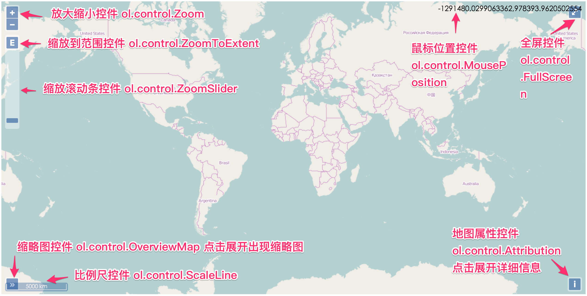

# 控件概览
OpenLayers 3目前内置的地图控件类都在包`ol.control`下面，依次有：

* `ol.control.Attribution`: 右下角的地图信息控件
* `ol.control.FullScreen`: 全屏控件
* `ol.control.MousePosition`: 鼠标位置控件
* `ol.control.OverviewMap`: 鸟瞰图控件
* `ol.control.Rotate`: 指北针控件
* `ol.control.ScaleLine`: 比例尺控件
* `ol.control.Zoom`: 缩放按钮控件
* `ol.control.ZoomSlider`: 缩放滚动条控件
* `ol.control.ZoomToExtent`: 放大到设定区域控件

每一个类都有一些设置参数，可对照官网API的文档来了解其对应的功能。 

默认情况下，在地图上是不会显示这么多地图控件的，只会应用`ol.control.defaults()`这个函数返回的地图控件，默认包含了`ol.control.Zoom`，`ol.control.Rotate`和`ol.control.Attribution`这个控件。 其使用方式同`ol.interaction.defaults()`很像，同样可以设置一些参数来控制控件的一些功能，从而实现定制化需求。 比如下面这个地图上的控件稍微的同默认情况下的控件有点不一样，因为控件都不存在了。

<head>                  
	<link href="../src/ol3.13.1/ol.css" rel="stylesheet" type="text/css" />
	<script type="text/javascript" src="../src/ol3.13.1/ol.js" charset="utf-8"></script>
</head>
<div id="map" style="width: 100%"></div>
<script type="text/javascript">
	var map = new ol.Map({
		controls: ol.control.defaults({
			attribution: false,
			rotate: false,
			zoom: false
		}),
		layers: [
		  new ol.layer.Tile({
		    source: new ol.source.OSM()
		  })
		],
		target: 'map',
		view: new ol.View({
		  center: ol.proj.transform(
		      [104, 30], 'EPSG:4326', 'EPSG:3857'),
		  zoom: 10
		})
	});
</script>

代码如下：
```html
<head>                  
	<link href="../src/ol3.13.1/ol.css" rel="stylesheet" type="text/css" />
	<script type="text/javascript" src="../src/ol3.13.1/ol.js" charset="utf-8"></script>
</head>
<div id="map" style="width: 100%"></div>
<script type="text/javascript">
	var map = new ol.Map({
		// 设置地图控件，默认的三个控件都不显示
		controls: ol.control.defaults({
			attribution: false,
			rotate: false,
			zoom: false
		}),
		layers: [
		  new ol.layer.Tile({
		    source: new ol.source.OSM()
		  })
		],
		target: 'map',
		view: new ol.View({
		  center: ol.proj.transform(
		      [104, 30], 'EPSG:4326', 'EPSG:3857'),
		  zoom: 10
		})
	});
</script>
```
当然，上面这个代码有更简洁的写法: `controls: []`，上面只是演示`ol.control.defaults`方法的使用而已。 如果需要把所有控件都显示出来，那么可以这样：

<div id="map2" style="width: 100%"></div>
<script type="text/javascript">
	var map2 = new ol.Map({
		controls: ol.control.defaults().extend([
			new ol.control.FullScreen(),
			new ol.control.MousePosition(),
			new ol.control.OverviewMap(),
			new ol.control.ScaleLine(),
			new ol.control.ZoomSlider(),
			new ol.control.ZoomToExtent()
		]),
		layers: [
		  new ol.layer.Tile({
		    source: new ol.source.OSM()
		  })
		],
		target: 'map2',
		view: new ol.View({
		  center: ol.proj.transform(
		      [104, 30], 'EPSG:4326', 'EPSG:3857'),
		  zoom: 10
		})
	});
</script>

有些控件重叠在一起，得仔细分辨。 代码如下：

```html
<div id="map2" style="width: 100%"></div>
<script type="text/javascript">
	var map2 = new ol.Map({
		// 在默认控件的基础上，再加上其他内置的控件
		controls: ol.control.defaults().extend([
			new ol.control.FullScreen(),
			new ol.control.MousePosition(),
			new ol.control.OverviewMap(),
			new ol.control.ScaleLine(),
			new ol.control.ZoomSlider(),
			new ol.control.ZoomToExtent()
		]),
		layers: [
		  new ol.layer.Tile({
		    source: new ol.source.OSM()
		  })
		],
		target: 'map2',
		view: new ol.View({
		  center: ol.proj.transform(
		      [104, 30], 'EPSG:4326', 'EPSG:3857'),
		  zoom: 10
		})
	});
</script>
```
下图是一个界面控件和类的对照关系图：


每一个控件都有相应的参数设置，如果具体到某一个控件使用时，不能满足需求，可以先参照官网API说明，进行相应使用。