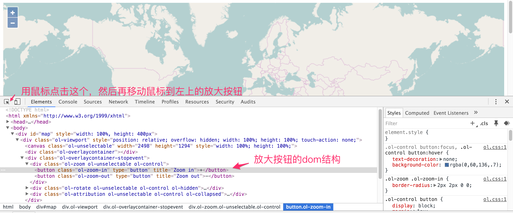

# 探究控件原理
在介绍后续的知识之前，先探究一下控件是如何做成的。 在chrome中打开一个最简单的地图例子，打开开发者工具面板，用工具栏最左边的元素选择器选择地图左上方的放大按钮，可以看到类似如下的界面：


上图可以看到放大按钮完整的dom结构图，从而一窥究竟，按钮原来就是简单的HTML的元素，结合`css`的效果做出来的，可以看到放大按钮的`css class`为`ol-zoom-in`，紧接着的就是缩小按钮的节点，其`css class`为`ol-zoom-out`，他们的父节点也有对应的`css class`： `ol-zoom`。 我们可以在`ol.css`文件中找到这些`class`的定义，设置了相应的样式。 控件`ui`的原理是清楚了，那么对应的控件要响应一些鼠标或者按键操作，应该也就是添加响应的事件监听器就可以了。

对于具体怎么做的，我们可以从控件`ol.control.Zoom`的部分源码来分析：

```javascript
	// 设定放大缩小按钮的提示信息
  var zoomInTipLabel = options.zoomInTipLabel !== undefined ?
      options.zoomInTipLabel : 'Zoom in';
  var zoomOutTipLabel = options.zoomOutTipLabel !== undefined ?
      options.zoomOutTipLabel : 'Zoom out';

  // 创建放大按钮的dom节点
  var inElement = goog.dom.createDom('BUTTON', {
    'class': className + '-in',
    'type' : 'button',
    'title': zoomInTipLabel
  }, zoomInLabel);

  // 并绑定鼠标点击事件的处理函数 handleClick_
  ol.events.listen(inElement,
      ol.events.EventType.CLICK, goog.partial(
          ol.control.Zoom.prototype.handleClick_, delta), this);

  ......

  // 函数定义如下
  /**
	 * @param {number} delta Zoom delta.
	 * @param {Event} event The event to handle
	 * @private
	 */
	ol.control.Zoom.prototype.handleClick_ = function(delta, event) {
	  event.preventDefault(); // 阻止事件传递到下面的map
	  this.zoomByDelta_(delta);	// 调用具体的方法进行放大
	};
```
这个过程和我们平时的在界面上添加一个节点，再绑定事件处理函数，并没有什么差别，其他类似的控件也是一样的原理。这对我们来说，想改变`ui`样式，是非常容易的事，甚至可以改变它的默认行为。


