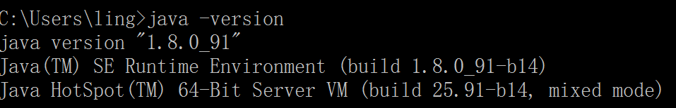
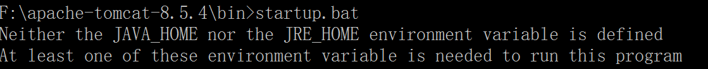
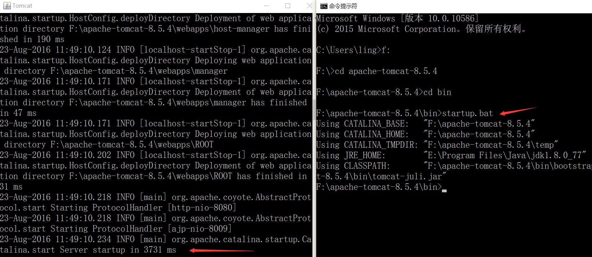
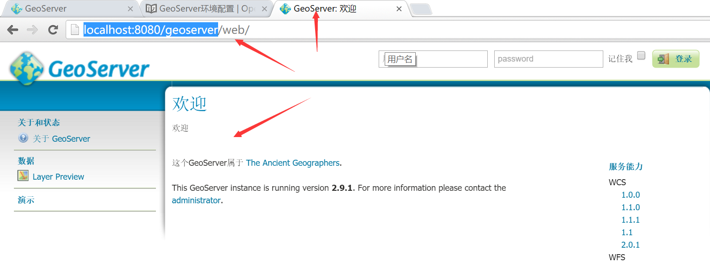
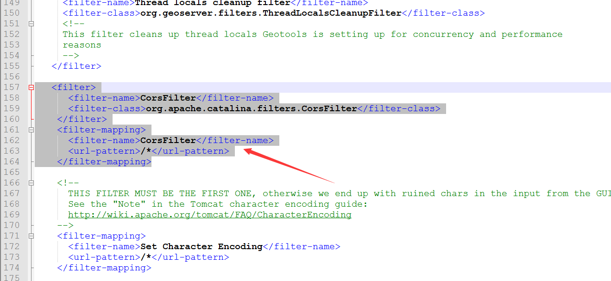

# 在windows环境下配置GeoServer

由于wfs协议涉及到跨域的问题，在配置过程中，我们也将把跨域的环境配置好。虽然跨域的解决方式有很多，但此处选择一个稍微简单的方式，详见下面的具体步骤。

## 安装Java环境
我们使用tomcat作为服务器，所以需要java环境，如果你不确定是否安装有java环境，则可以在命令终端执行： `java -version`，比如我的环境：


如果提示`java`命令找不到的错误，说明你得优先安装java环境，请到[官网](http://www.java.com/zh_CN/)下载最新的Java进行安装。
 
## 下载Tomcat
安装好java环境后，我们就到[Tomcat官网](http://tomcat.apache.org/)下载Tomcat，如果java环境是64位的，记得下载64位的Tomcat，如果是32位的java环境，就需要下载32位的tomcat。如上图所示，我的是64位java环境，我选择下载8.5.4版本，64位的windows环境的tomcat： [apache-tomcat-8.5.4-windows-x64.zip](https://mirrors.tuna.tsinghua.edu.cn/apache/tomcat/tomcat-8/v8.5.4/bin/apache-tomcat-8.5.4-windows-x64.zip)。

下载后，解压到一个指定的目录， 我放在了`F:\apache-tomcat-8.5.4`。记住，解压就可以了，免安装，此时需要验证一下是否能正常启动Tomcat，启动命令终端，执行tomcat目录下的`bin\startup.bat`，如下：


从上图可以发现，我们还没有配置环境变量`JAVA_HOME`或者`JRE_HOME`。那么我先配置一个`JAVA_HOME`的环境变量，配置好后，记得注销或者重启电脑，让环境变量生效。 然后重新执行命令，正确启动如下：


成功启动会弹出一个新的`tomcat`命令行窗口，参见上图左边的命令行窗口。

## 安装GeoServer
此时，我们需要到[GeoServer官网](http://geoserver.org/)去下载geoserver，我选择了最新的2.9.1版本，由于我使用tomcat作为服务器，所以我选择下载`Web Archive`格式的[geoserver-2.9.1-war.zip](https://sourceforge.net/projects/geoserver/files/GeoServer/2.9.1/geoserver-2.9.1-war.zip/download)。

下载后解压到得到war文件：`geoserver.war`，把该文件放置到tomcat目录下的webapps目录下，比如放置该文件后，我的路径为：`F:\apache-tomcat-8.5.4\webapps\geoserver.war`。

然后在命令行终端启动tomcat，可能需要稍微等待一下，因为要部署geoserver，待tomcat命令行终端启动完成，就可以打开浏览器输入`http://localhost:8080/geoserver`打开geoserver的管理页面，如下：


见到这个页面，也就安装成功了。如果没有出现该页面，请按照前面的步骤检查一下什么地方出问题了。

## 跨域配置
由于tomcat从7.0.41版本开始就支持跨域了，参见[CORS on Tomcat](http://enable-cors.org/server_tomcat.html)，我们下载的tomcat是8.5.4，自然就能很好的支持了，只需要进行下面的简单配置：
* 找到geoserver的`web.xml`文件，我的电脑对应的路径为`F:\apache-tomcat-8.5.4\webapps\geoserver\WEB-INF\web.xml`
* 打开该文件，把下面的配置添加在该文件中：
  ```
    <filter>
	  <filter-name>CorsFilter</filter-name>
	  <filter-class>org.apache.catalina.filters.CorsFilter</filter-class>
	</filter>
	<filter-mapping>
	  <filter-name>CorsFilter</filter-name>
	  <url-pattern>/*</url-pattern>
	</filter-mapping>
  ```
  


然后再重新启动tomcat即可。


