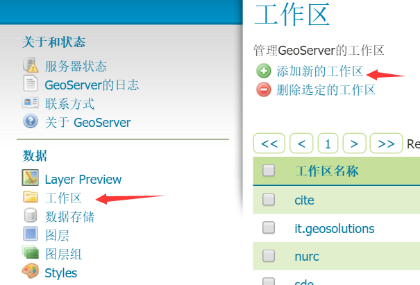
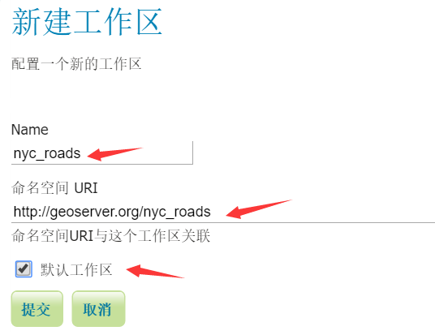
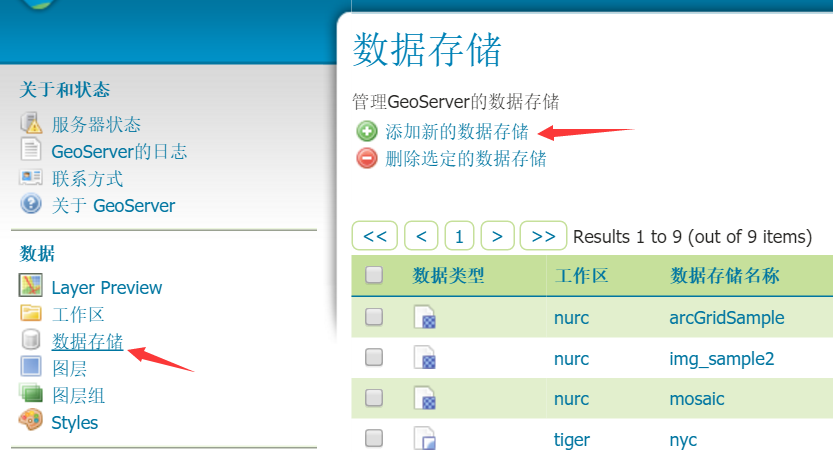
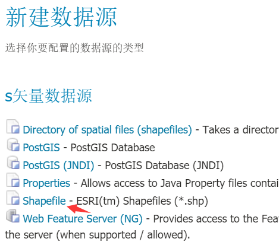
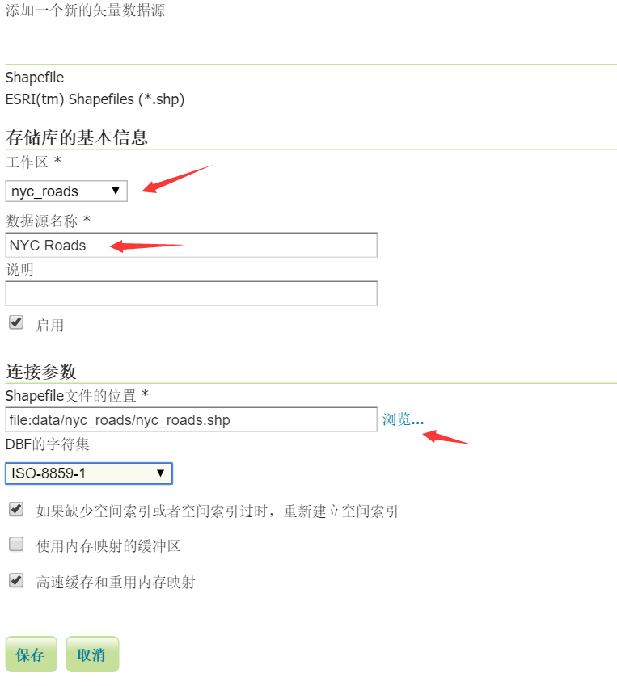
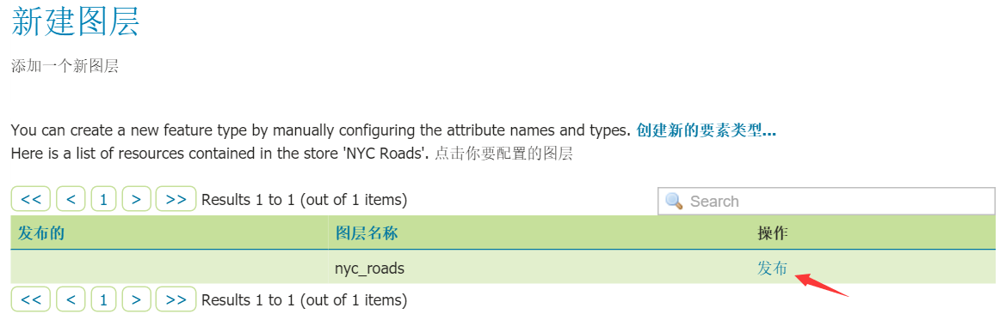
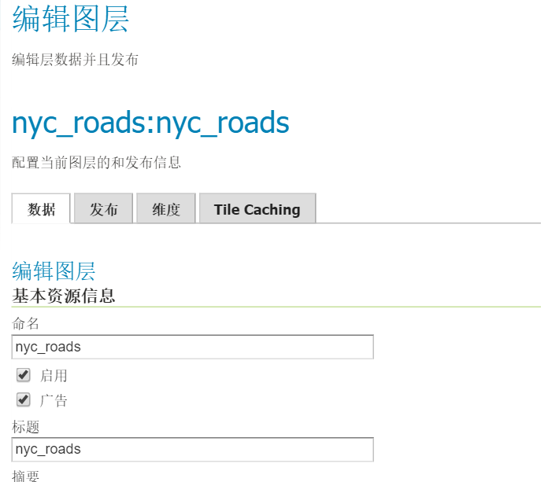
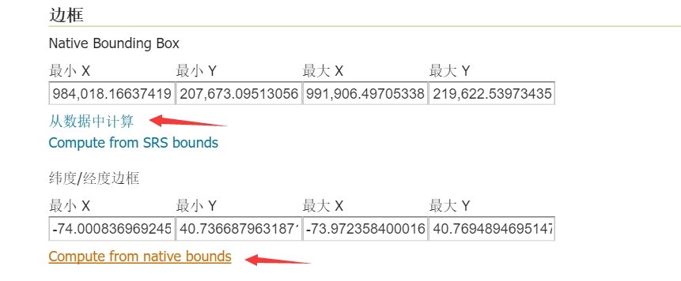
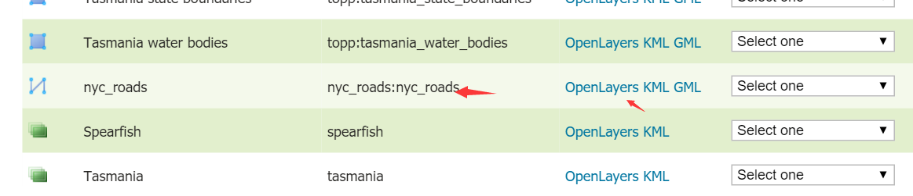
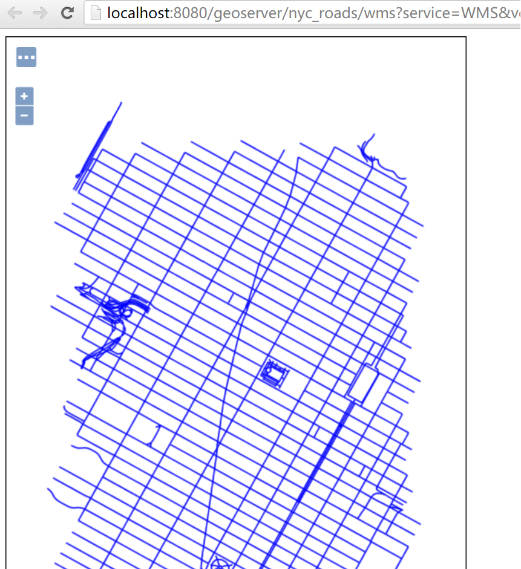

# 配置数据源

为了后续进行wfs的各项使用演示，我就使用geoserver官方中使用的数据[nyc_roads.zip](http://docs.geoserver.org/latest/en/user/_downloads/nyc_roads.zip)。这份数据的配置，官网也提供了指导，参见[Publishing a shapefile](http://docs.geoserver.org/latest/en/user/gettingstarted/shapefile-quickstart/index.html)。

下面就以我的计算机配置为例，进行说明：

1. 下载后解压，把压缩包里面的`nyc_roads.dbf, nyc_roads.prj, nyc_roads.shp, nyc_roads.shx`放在目录`F:\apache-tomcat-8.5.4\webapps\geoserver\data\data\nyc_roads`下，`nyc_roads`这个目录没有，就新建一个。

2. 启动tomcat，在浏览器中打开geoserver的配置页面`http://localhost:8080/geoserver`，使用用户admin登录，密码为geoserver。

3. 创建`工作区`：

4. 创建`数据存储`：

5. 创建`图层`，数据源配置好后，保存，就出现下面这个界面：

点击`发布`创建新图层：

最后点击页面最下方的`保存`按钮，就配置好了。

6. 最后预览一下，点击左边的`Layer Preview`，在右边找到刚才创建的图层`nyc_roads:nyc_roads`，点击右边的OpenLayers，就可以打开新页面，显示预览结果。

出现最后一个页面，就说明数据源配置好了。 
