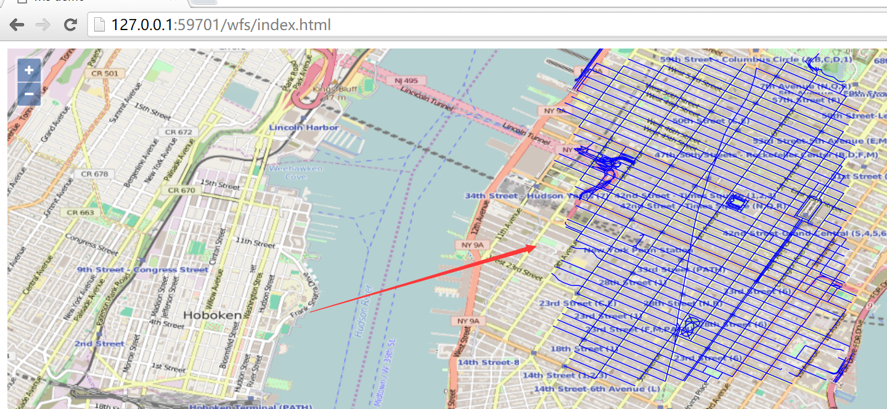

# 通过wfs查询要素

一切都准备好了，现在终于可以通过ol3加载配置好的数据了。上一节中最后的预览结果，大家已经看到了，此处我们自己通过ol3来实现这个预览页面，效果图如下：



对应的代码如下：
```html
<html>

<head>
  <title>wfs demo</title>
  <link rel="stylesheet" href="../ol3.15.1/ol.css" type="text/css" />
  <script src="../ol3.17.1/ol-debug.js" type="text/javascript" charset="utf-8"></script>
</head>

<body>

  <div id="map" style="width:100%;height:100%;"></div>

  <script>
    var vector = new ol.layer.Vector({
      source: new ol.source.Vector({
        format: new ol.format.GeoJSON(),
        url: 'http://localhost:8080/geoserver/wfs?service=wfs&version=1.1.0&request=GetFeature&typeNames=nyc_roads:nyc_roads&outputFormat=application/json&srsname=EPSG:4326'
      }),
      style: function(feature, resolution) {
        return new ol.style.Style({
          stroke: new ol.style.Stroke({
            color: 'blue',
            width: 1
          })
        });
      }
    });

    var map = new ol.Map({
      layers: [new ol.layer.Tile({
        source: new ol.source.OSM()
      }), vector],
      target: 'map',
      view: new ol.View({
        center: [-73.99710639567148, 40.742270050255556],
        maxZoom: 19,
        zoom: 14,
        projection: 'EPSG:4326'
      })
    });
  </script>

</body>

</html>
```

和一般的矢量地图加载没什么两样，对于wfs而言，需要弄明白的是`ol.source.Vector`的`url`参数： `http://localhost:8080/geoserver/wfs?service=wfs&version=1.1.0&request=GetFeature&typeNames=nyc_roads:nyc_roads&outputFormat=application/json&srsname=EPSG:4326`。 如果对wfs协议不太清楚的，建议优先看一下geoserver的官网文档[WFS](http://docs.geoserver.org/stable/en/user/services/wfs/index.html)。 

此处我们要获取所有的要素，所以设置`request=GetFeature`，`typeNames`的值设置为`nyc_roads:nyc_roads`，是因为我们之前配置的图层命名如此，可以在geoserver管理页面的`Layer Preview`里面看对应图层的`Name`。 对于`outputFormat`和`srsname`就不做过多解释，大家看值就容易明白了。因为`view`设置的`projection: 'EPSG:4326'`，所以此处设置`srsname=EPSG:4326`。

BTW: 上面是全部查询，我们知道wfs也支持filter，所以我们可以在`url`里面设置filter，从而实现更细粒度的查询，比如这样：`http://localhost:8080/geoserver/wfs?service=wfs&version=1.1.0&request=GetFeature&typeNames=nyc_roads:nyc_roads&outputFormat=application/json&srsname=EPSG:4326&cql_filter=in ('nyc_roads.1162')`。 大家可以自行用这个url进行测试一下。关于filter更详细的信息参见[Supported filter languages](http://docs.geoserver.org/latest/en/user/filter/syntax.html)。 因为这不是教程的重点，所以此处不进行细说。