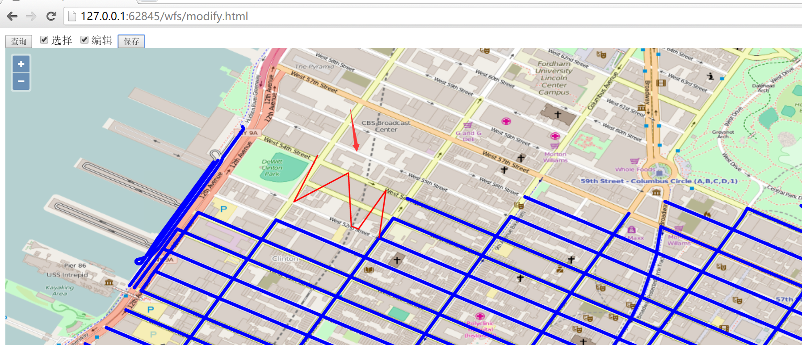

# 通过wfs修改要素

在查询的基础上，本小节我们更进一步对界面上呈现的要素进行修改，然后通过wfs协议保存到服务器端。界面效果如下:



在界面上方，先点击`查询`按钮，通过wfs协议把所有的要素查询到前端界面上显示，然后选择复选框`编辑`，就可以选择界面上的线段，进行编辑，比如把直线编辑成`W`形状，然后点击按钮`保存`，就可以把编辑后的线段保存下来。

在点击`保存`按钮之前，请打开开发者面板，然后再点击`保存`，之后就可以看到发起了一个wfs的http请求到geoserver服务器，请求的url为：`http://localhost:8080/geoserver/wfs?service=wfs`，发送的内容大致为: 
```
<Transaction xmlns="http://www.opengis.net/wfs" service="WFS" version="1.1.0" xmlns:xsi="http://www.w3.org/2001/XMLSchema-instance" xsi:schemaLocation="http://www.opengis.net/wfs http://schemas.opengis.net/wfs/1.1.0/wfs.xsd">
  <Update typeName="feature:nyc_roads" xmlns:feature="http://geoserver.org/nyc_roads">
    <Property>
      <Name>the_geom</Name>
      <Value>
        <MultiLineString xmlns="http://www.opengis.net/gml" srsName="EPSG:4326">
          <lineStringMember>
            <LineString srsName="EPSG:4326">
              <posList>-73.98528635501862 40.768332481384284 -73.98608637 40.76719342 -73.98449242115021 40.767849683761604 -73.98447096347809 40.76647639274598 -73.98299038410187 40.767334699630744 -73.98336657 40.76604531</posList>
            </LineString>
          </lineStringMember>
        </MultiLineString>
      </Value>
    </Property>
    <Property>
      <Name>modified</Name>
      <Value>5/28/2001</Value>
    </Property>
    <Property>
      <Name>name</Name>
      <Value>W 56 ST</Value>
    </Property>
    <Property>
      <Name>vsam</Name>
      <Value>15060</Value>
    </Property>
    <Property>
      <Name>sourcedate</Name>
      <Value>3/31/1996</Value>
    </Property>
    <Property>
      <Name>sourcetype</Name>
      <Value>Photogrammetric</Value>
    </Property>
    <Property>
      <Name>source_id</Name>
      <Value>96083</Value>
    </Property>
    <Property>
      <Name>borough</Name>
      <Value>Manhattan</Value>
    </Property>
    <Property>
      <Name>feat_code</Name>
      <Value>2900</Value>
    </Property>
    <Property>
      <Name>feat_desc</Name>
      <Value>Paved Road</Value>
    </Property>
    <Property>
      <Name>exported</Name>
      <Value>05/19/2004</Value>
    </Property>
    <Property>
      <Name>feat_type</Name>
      <Value>0</Value>
    </Property>
    <Filter xmlns="http://www.opengis.net/ogc">
      <FeatureId fid="nyc_roads.882" />
    </Filter>
  </Update>
</Transaction>
```
如果保存成功，则`response`的内容大致如下：
```
<?xml version="1.0" encoding="UTF-8"?>
<wfs:TransactionResponse 
  xmlns:xs="http://www.w3.org/2001/XMLSchema" 
  xmlns:sf="http://www.openplans.org/spearfish" 
  xmlns:wfs="http://www.opengis.net/wfs" 
  xmlns:gml="http://www.opengis.net/gml" 
  xmlns:nyc_roads="http://geoserver.org/nyc_roads" 
  xmlns:ogc="http://www.opengis.net/ogc" 
  xmlns:ows="http://www.opengis.net/ows" 
  xmlns:tiger="http://www.census.gov" 
  xmlns:topp="http://www.openplans.org/topp" 
  xmlns:xlink="http://www.w3.org/1999/xlink" x
  mlns:xsi="http://www.w3.org/2001/XMLSchema-instance" 
  version="1.1.0" 
  xsi:schemaLocation="http://www.opengis.net/wfs http://localhost:8080/geoserver/schemas/wfs/1.1.0/wfs.xsd">

  <wfs:TransactionSummary>
    <wfs:totalInserted>0</wfs:totalInserted>
    <wfs:totalUpdated>1</wfs:totalUpdated>
    <wfs:totalDeleted>0</wfs:totalDeleted>
  </wfs:TransactionSummary>
  <wfs:TransactionResults/>
  <wfs:InsertResults>
    <wfs:Feature><ogc:FeatureId fid="none"/></wfs:Feature>
  </wfs:InsertResults>
</wfs:TransactionResponse>
```
重新刷新页面后，再次点击`查询`按钮，可以验证之前修改的线段是否修改成功。由于不能提供geoserver服务器，所以只能让大家自行用下面的代码在本地验证：

```html
<html>

<head>
  <title>wfs modify demo</title>
  <link rel="stylesheet" href="../ol3.17.1/ol.css" type="text/css" />
  <script src="../ol3.17.1/ol-debug.js" type="text/javascript" charset="utf-8"></script>
  <script src="../3rdparty/zepto.min.js" type="text/javascript" charset="utf-8"></script>
</head>

<body>
  <input type="button" value="查询" onclick="queryWfs();" />
  <input id="select" type="checkbox" value="select" />选择
  <input id="modify" type="checkbox" value="modify" />编辑
  <input id="save" type="button" value="保存" onclick="onSave();" />

  <div id="map" style="width:100%;height:100%;"></div>

  <script>
    var wfsVectorLayer = null;
    var modifiedFeatures = null;

    // 选择器
    var selectInteraction = new ol.interaction.Select({
      style: new ol.style.Style({
        stroke: new ol.style.Stroke({
          color: 'red',
          width: 2
        })
      })
    });

    // 修改器
    var modifyInteraction = new ol.interaction.Modify({
      style: new ol.style.Style({
        stroke: new ol.style.Stroke({
          color: 'red',
          width: 5
        })
      }),
      features: selectInteraction.getFeatures()
    });
    modifyInteraction.on('modifyend', function(e) {
      // 把修改完成的feature暂存起来
      modifiedFeatures = e.features;
    });

    var map = new ol.Map({
      layers: [new ol.layer.Tile({
        source: new ol.source.OSM()
      })],
      target: 'map',
      view: new ol.View({
        center: [-73.99710639567148, 40.742270050255556],
        maxZoom: 19,
        zoom: 13,
        projection: 'EPSG:4326'
      })
    });

    // 通过wfs查询所有的要素
    function queryWfs() {
      // 支持重新查询
      if (wfsVectorLayer) {
        map.removeLayer(wfsVectorLayer);
      }
      
      // 创建新的图层来加载wfs的要素
      wfsVectorLayer = new ol.layer.Vector({
        source: new ol.source.Vector({
          format: new ol.format.GeoJSON({
            geometryName: 'the_geom' // 因为数据源里面字段the_geom存储的是geometry，所以需要指定
          }),
          url: 'http://localhost:8080/geoserver/wfs?service=wfs&version=1.1.0&request=GetFeature&typeNames=nyc_roads:nyc_roads&outputFormat=application/json&srsname=EPSG:4326'
        }),
        style: function(feature, resolution) {
          return new ol.style.Style({
            stroke: new ol.style.Stroke({
              color: 'blue',
              width: 5
            })
          });
        }
      });
      map.addLayer(wfsVectorLayer);
    }
    
    $('#select').change(function() {
      if (this.checked) {
        // 勾选选择复选框时，添加选择器到地图
        map.removeInteraction(selectInteraction);
        map.addInteraction(selectInteraction);
      } else {
        // 不勾选选择复选框的情况下，移出选择器和修改器
        map.removeInteraction(selectInteraction);
        document.getElementById('modify').checked = false;
        map.removeInteraction(modifyInteraction);
        modifiedFeatures = null;
      }
    });

    $('#modify').change(function() {
      if (this.checked) {
        // 勾选修改复选框时，添加选择器和修改器到地图
        document.getElementById('select').checked = true;
        map.removeInteraction(modifyInteraction);
        map.addInteraction(modifyInteraction);
        map.removeInteraction(selectInteraction);
        map.addInteraction(selectInteraction);
      } else {
        // 不勾选修改复选框时，移出修改器
        map.removeInteraction(modifyInteraction);
        modifiedFeatures = null;
      }
    });
    
    // 保存已经编辑的要素
    function onSave() {
      if (modifiedFeatures && modifiedFeatures.getLength() > 0) {

        // 转换坐标
        var modifiedFeature = modifiedFeatures.item(0).clone();
        // 注意ID是必须，通过ID才能找到对应修改的feature
        modifiedFeature.setId(modifiedFeatures.item(0).getId());
        // 调换经纬度坐标，以符合wfs协议中经纬度的位置
        modifiedFeature.getGeometry().applyTransform(function(flatCoordinates, flatCoordinates2, stride) {
          for (var j = 0; j < flatCoordinates.length; j += stride) {
            var y = flatCoordinates[j];
            var x = flatCoordinates[j + 1];
            flatCoordinates[j] = x;
            flatCoordinates[j + 1] = y;
          }
        });
        modifyWfs([modifiedFeature]);
      }
    }
    
    // 把修改提交到服务器端
    function modifyWfs(features) {
      var WFSTSerializer = new ol.format.WFS();
      var featObject = WFSTSerializer.writeTransaction(null,
        features, null, {
          featureType: 'nyc_roads', 
          featureNS: 'http://geoserver.org/nyc_roads',  // 注意这个值必须为创建工作区时的命名空间URI
          srsName: 'EPSG:4326'
        });
      // 转换为xml内容发送到服务器端
      var serializer = new XMLSerializer();
      var featString = serializer.serializeToString(featObject);
      var request = new XMLHttpRequest();
      request.open('POST', 'http://localhost:8080/geoserver/wfs?service=wfs');
      // 指定内容为xml类型
      request.setRequestHeader('Content-Type', 'text/xml');
      request.send(featString);
    }
  </script>

</body>

</html>
```
