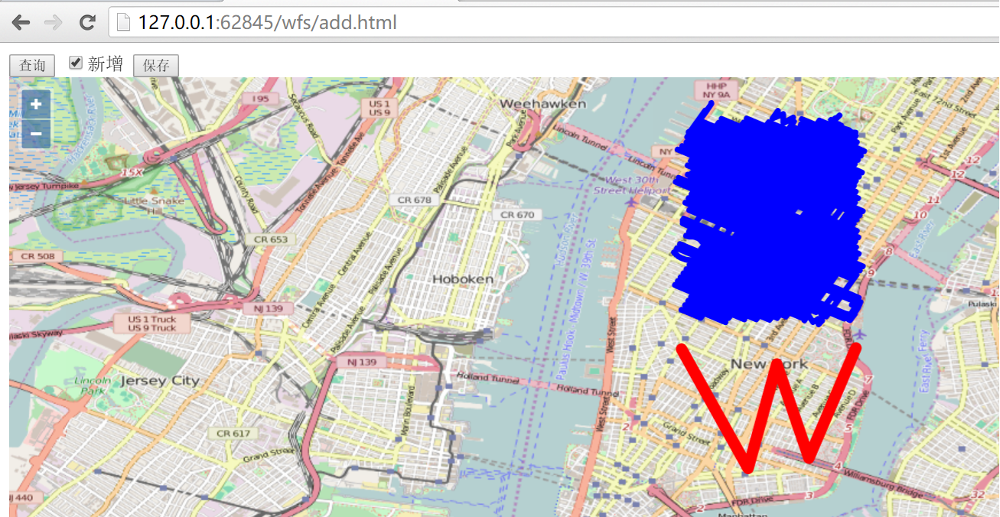

# 通过wfs添加要素

现在我们该介绍一下如何在前端绘制一个新的要素，并且保存到服务器端。还是先看一下界面：



勾选`新增`复选框之后，就可以在界面上绘制新的线段，如图，绘制了一个`W`形状的线，绘制完成后，点击按钮`保存`就可以把界面上新增的线保存到服务器端，在开发者工具界面可以看到http请求: `http://localhost:8080/geoserver/wfs?service=wfs`，请求发送的内容为：
```
<Transaction xmlns="http://www.opengis.net/wfs" service="WFS" version="1.1.0" xmlns:xsi="http://www.w3.org/2001/XMLSchema-instance" xsi:schemaLocation="http://www.opengis.net/wfs http://schemas.opengis.net/wfs/1.1.0/wfs.xsd">
  <Insert>
    <nyc_roads xmlns="http://geoserver.org/nyc_roads" fid="nyc_roads.new.1">
      <the_geom>
        <MultiLineString xmlns="http://www.opengis.net/gml" srsName="EPSG:4326">
          <lineStringMember>
            <LineString srsName="EPSG:4326">
              <posList>-73.99970054626465 40.732669830322266 -73.98974418640137 40.71481704711914 -73.98545265197754 40.730438232421875 -73.98064613342285 40.71636199951172 -73.97360801696777 40.73284149169922</posList>
            </LineString>
          </lineStringMember>
        </MultiLineString>
      </the_geom>
      <name>nyc_roads.new.1</name>
      <modified>nyc_roads.new.1</modified>
      <vsam>0</vsam>
      <sourcedate></sourcedate>
      <sourcetype></sourcetype>
      <source_id>1</source_id>
      <borough></borough>
      <feat_code>0</feat_code>
      <feat_desc>11</feat_desc>
      <feat_type>0</feat_type>
      <exported>true</exported>
    </nyc_roads>
  </Insert>
</Transaction>
```
服务器端`response`的内容为：
```
<?xml version="1.0" encoding="UTF-8"?>
  <wfs:TransactionResponse xmlns:xs="http://www.w3.org/2001/XMLSchema" xmlns:sf="http://www.openplans.org/spearfish" xmlns:wfs="http://www.opengis.net/wfs" xmlns:gml="http://www.opengis.net/gml" xmlns:nyc_roads="http://geoserver.org/nyc_roads" xmlns:ogc="http://www.opengis.net/ogc" xmlns:ows="http://www.opengis.net/ows" xmlns:tiger="http://www.census.gov" xmlns:topp="http://www.openplans.org/topp" xmlns:xlink="http://www.w3.org/1999/xlink" xmlns:xsi="http://www.w3.org/2001/XMLSchema-instance" version="1.1.0" xsi:schemaLocation="http://www.opengis.net/wfs http://localhost:8080/geoserver/schemas/wfs/1.1.0/wfs.xsd">
    <wfs:TransactionSummary>
      <wfs:totalInserted>1</wfs:totalInserted>
      <wfs:totalUpdated>0</wfs:totalUpdated>
      <wfs:totalDeleted>0</wfs:totalDeleted>
    </wfs:TransactionSummary>
    <wfs:TransactionResults/>
    <wfs:InsertResults>
      <wfs:Feature>
        <ogc:FeatureId fid="new0" />
      </wfs:Feature>
    </wfs:InsertResults>
  </wfs:TransactionResponse>
```
通过再次刷新界面，点击`查询`按钮查看所有的feature，可以确认是否添加成功，请自行验证。下面给出对应的代码：

```
<html>

<head>
  <title>wfs add demo</title>
  <link rel="stylesheet" href="../ol3.17.1/ol.css" type="text/css" />
  <script src="../ol3.17.1/ol-debug.js" type="text/javascript" charset="utf-8"></script>
  <script src="../3rdparty/zepto.min.js" type="text/javascript" charset="utf-8"></script>
</head>

<body>
  <input type="button" value="查询" onclick="queryWfs();" />
  <input id="add" type="checkbox" value="add" />新增
  <input id="saveNew" type="button" value="保存" onclick="onSaveNew();" />

  <div id="map" style="width:100%;height:100%;"></div>

  <script>
    var newId = 1;
    var wfsVectorLayer = null;
    var drawedFeature = null;
    
    // 创建用于新绘制feature的layer
    var drawLayer = new ol.layer.Vector({
      source: new ol.source.Vector(),
      style: new ol.style.Style({
        stroke: new ol.style.Stroke({
          color: 'blue',
          width: 5
        })
      })
    });

    // 添加绘制新图形的interaction，用于添加新的线条
    var drawInteraction = new ol.interaction.Draw({
      type: 'LineString', // 设定为线条
      style: new ol.style.Style({
        stroke: new ol.style.Stroke({
          color: 'red',
          width: 10
        })
      }),
      source: drawLayer.getSource()
    });
    drawInteraction.on('drawend', function(e) {
      // 绘制结束时暂存绘制的feature
      drawedFeature = e.feature;
    });

    var map = new ol.Map({
      layers: [new ol.layer.Tile({
        source: new ol.source.OSM()
      }), drawLayer],
      target: 'map',
      view: new ol.View({
        center: [-73.99710639567148, 40.742270050255556],
        maxZoom: 19,
        zoom: 13,
        projection: 'EPSG:4326'
      })
    });

    function queryWfs() {
      if (wfsVectorLayer) {
        map.removeLayer(wfsVectorLayer);
      }

      wfsVectorLayer = new ol.layer.Vector({
        source: new ol.source.Vector({
          format: new ol.format.GeoJSON({
            geometryName: 'the_geom'
          }),
          url: 'http://localhost:8080/geoserver/wfs?service=wfs&version=1.1.0&request=GetFeature&typeNames=nyc_roads:nyc_roads&outputFormat=application/json&srsname=EPSG:4326'
        }),
        style: function(feature, resolution) {
          return new ol.style.Style({
            stroke: new ol.style.Stroke({
              color: 'blue',
              width: 5
            })
          });
        }
      });
      map.addLayer(wfsVectorLayer);
    }

    $('#add').change(function() {
      if (this.checked) {
        // 勾选新增复选框时，添加绘制的Interaction
        map.removeInteraction(drawInteraction);
        map.addInteraction(drawInteraction);
      } else {
        // 取消勾选新增复选框时，移出绘制的Interaction，删除已经绘制的feature
        map.removeInteraction(drawInteraction);
        if (drawedFeature) {
          drawLayer.getSource().removeFeature(drawedFeature);
        }
        drawedFeature = null;
      }
    });

    // 保存新绘制的feature
    function onSaveNew() {
      // 转换坐标
      var geometry = drawedFeature.getGeometry().clone();
      geometry.applyTransform(function(flatCoordinates, flatCoordinates2, stride) {
        for (var j = 0; j < flatCoordinates.length; j += stride) {
          var y = flatCoordinates[j];
          var x = flatCoordinates[j + 1];
          flatCoordinates[j] = x;
          flatCoordinates[j + 1] = y;
        }
      });
      
      // 设置feature对应的属性，这些属性是根据数据源的字段来设置的
      var newFeature = new ol.Feature();
      newFeature.setId('nyc_roads.new.' + newId);
      newFeature.setGeometryName('the_geom');
      newFeature.set('the_geom', null);
      newFeature.set('name', newFeature.getId());
      newFeature.set('modified', newFeature.getId());
      newFeature.set('vsam', 0);
      newFeature.set('sourcedate', '');
      newFeature.set('sourcetype', '');
      newFeature.set('source_id', newId);
      newFeature.set('borough', '');
      newFeature.set('feat_code', 0);
      newFeature.set('feat_desc', '11');
      newFeature.set('feat_type', 0);
      newFeature.set('exported', 'true');
      newFeature.setGeometry(new ol.geom.MultiLineString([geometry.getCoordinates()]));

      addWfs([newFeature]);
      // 更新id
      newId = newId + 1;
      // 3秒后，自动刷新页面上的feature
      setTimeout(function() {
        drawLayer.getSource().clear();
        queryWfs();
      }, 3000);
    }
    
    // 添加到服务器端
    function addWfs(features) {
      var WFSTSerializer = new ol.format.WFS();
      var featObject = WFSTSerializer.writeTransaction(features,
        null, null, {
          featureType: 'nyc_roads',
          featureNS: 'http://geoserver.org/nyc_roads',
          srsName: 'EPSG:4326'
        });
      var serializer = new XMLSerializer();
      var featString = serializer.serializeToString(featObject);
      var request = new XMLHttpRequest();
      request.open('POST', 'http://localhost:8080/geoserver/wfs?service=wfs');
      request.setRequestHeader('Content-Type', 'text/xml');
      request.send(featString);
    }
  </script>

</body>

</html>
```
