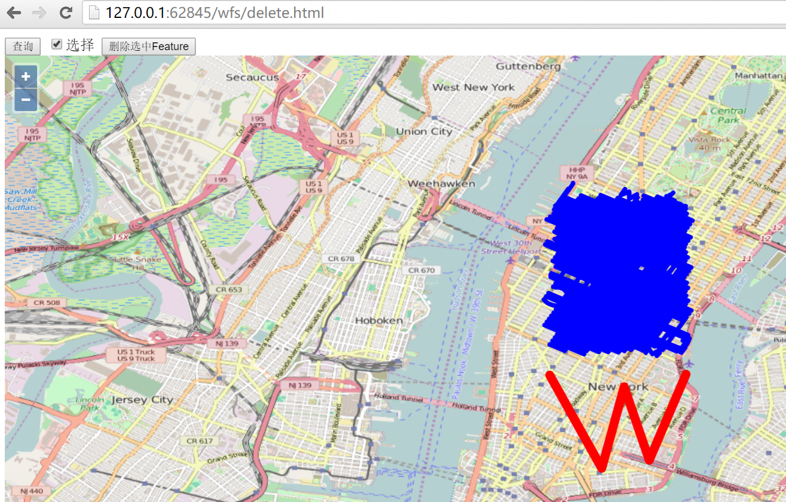

# 通过wfs删除要素

删除feature是wfs协议中的最后一个例子了，和之前的修改，添加差不多，大同小异。还是先看界面：



选择`查询`按钮，把所有的feature加载到前端，然后勾选`选择`复选框，就可以在地图上选择要删除的feature，图示选择之前添加的`W`形状的线条，然后点击`删除选中Feature`按钮，就可以把feature删除掉。

在开发者工具窗口里面可以看到删除feature的http请求： `http://localhost:8080/geoserver/wfs?service=wfs`，其发送的内容为：
```
<Transaction xmlns="http://www.opengis.net/wfs" service="WFS" version="1.1.0" xmlns:xsi="http://www.w3.org/2001/XMLSchema-instance" xsi:schemaLocation="http://www.opengis.net/wfs http://schemas.opengis.net/wfs/1.1.0/wfs.xsd">
  <Delete typeName="feature:nyc_roads" xmlns:feature="http://geoserver.org/nyc_roads">
    <Filter xmlns="http://www.opengis.net/ogc">
      <FeatureId fid="nyc_roads.1302" />
    </Filter>
  </Delete>
</Transaction>
```
服务器端`response`的内容为：
```
<?xml version="1.0" encoding="UTF-8"?>
  <wfs:TransactionResponse xmlns:xs="http://www.w3.org/2001/XMLSchema" xmlns:sf="http://www.openplans.org/spearfish" xmlns:wfs="http://www.opengis.net/wfs" xmlns:gml="http://www.opengis.net/gml" xmlns:nyc_roads="http://geoserver.org/nyc_roads" xmlns:ogc="http://www.opengis.net/ogc" xmlns:ows="http://www.opengis.net/ows" xmlns:tiger="http://www.census.gov" xmlns:topp="http://www.openplans.org/topp" xmlns:xlink="http://www.w3.org/1999/xlink" xmlns:xsi="http://www.w3.org/2001/XMLSchema-instance" version="1.1.0" xsi:schemaLocation="http://www.opengis.net/wfs http://localhost:8080/geoserver/schemas/wfs/1.1.0/wfs.xsd">
    <wfs:TransactionSummary>
      <wfs:totalInserted>0</wfs:totalInserted>
      <wfs:totalUpdated>0</wfs:totalUpdated>
      <wfs:totalDeleted>1</wfs:totalDeleted>
    </wfs:TransactionSummary>
    <wfs:TransactionResults/>
    <wfs:InsertResults>
      <wfs:Feature>
        <ogc:FeatureId fid="none" />
      </wfs:Feature>
    </wfs:InsertResults>
  </wfs:TransactionResponse>
```
通过再次刷新查询，可以确认刚才的feature是否成功删除。请自行验证，对应实例的代码如下：
```html
<html>

<head>
  <title>wfs crud demo</title>
  <link rel="stylesheet" href="../ol3.17.1/ol.css" type="text/css" />
  <script src="../ol3.17.1/ol-debug.js" type="text/javascript" charset="utf-8"></script>
  <script src="../3rdparty/zepto.min.js" type="text/javascript" charset="utf-8"></script>
</head>

<body>
  <input type="button" value="查询" onclick="queryWfs();" />
  <input id="select" type="checkbox" value="select" />选择
  <input id="delete" type="button" value="删除选中Feature" onclick="onDeleteFeature();" />

  <div id="map" style="width:100%;height:100%;"></div>

  <script>
    var wfsVectorLayer = null;

    // 选择器
    var selectInteraction = new ol.interaction.Select({
      style: new ol.style.Style({
        stroke: new ol.style.Stroke({
          color: 'red',
          width: 10
        })
      })
    });

    var map = new ol.Map({
      layers: [new ol.layer.Tile({
        source: new ol.source.OSM()
      })],
      target: 'map',
      view: new ol.View({
        center: [-73.99710639567148, 40.742270050255556],
        maxZoom: 19,
        zoom: 13,
        projection: 'EPSG:4326'
      })
    });

    function queryWfs() {
      if (wfsVectorLayer) {
        map.removeLayer(wfsVectorLayer);
      }

      wfsVectorLayer = new ol.layer.Vector({
        source: new ol.source.Vector({
          format: new ol.format.GeoJSON({
            geometryName: 'the_geom'
          }),
          url: 'http://localhost:8080/geoserver/wfs?service=wfs&version=1.1.0&request=GetFeature&typeNames=nyc_roads:nyc_roads&outputFormat=application/json&srsname=EPSG:4326'
        }),
        style: function(feature, resolution) {
          return new ol.style.Style({
            stroke: new ol.style.Stroke({
              color: 'blue',
              width: 5
            })
          });
        }
      });
      map.addLayer(wfsVectorLayer);
    }

    $('#select').change(function() {
      if (this.checked) {
        map.removeInteraction(selectInteraction);
        map.addInteraction(selectInteraction);
      } else {
        map.removeInteraction(selectInteraction);
      }
    });

    function onDeleteFeature() {
      // 删选择器选中的feature
      if (selectInteraction.getFeatures().getLength() > 0) {
        deleteWfs([selectInteraction.getFeatures().item(0)]);
        // 3秒后自动更新features
        setTimeout(function() {
          selectInteraction.getFeatures().clear();
          queryWfs();
        }, 3000);
      }
    }
    
    // 在服务器端删除feature
    function deleteWfs(features) {
      var WFSTSerializer = new ol.format.WFS();
      var featObject = WFSTSerializer.writeTransaction(null,
        null, features, {
          featureType: 'nyc_roads',
          featureNS: 'http://geoserver.org/nyc_roads',
          srsName: 'EPSG:4326'
        });
      var serializer = new XMLSerializer();
      var featString = serializer.serializeToString(featObject);
      var request = new XMLHttpRequest();
      request.open('POST', 'http://localhost:8080/geoserver/wfs?service=wfs');
      request.setRequestHeader('Content-Type', 'text/xml');
      request.send(featString);
    }
  </script>

</body>

</html>
```